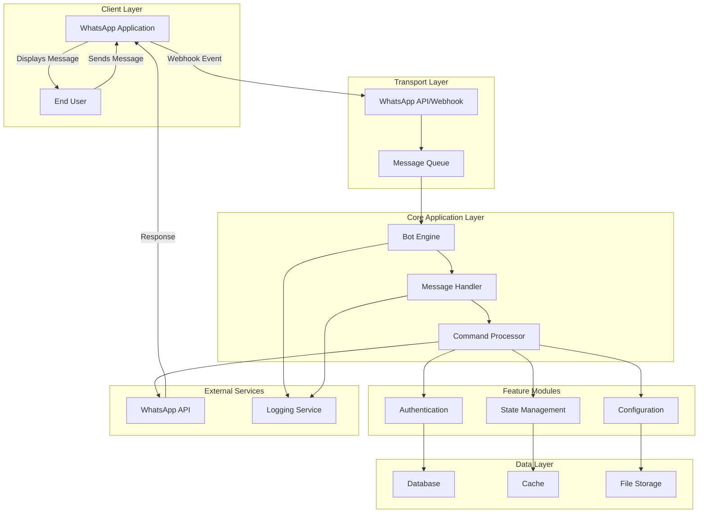

# Architecture Overview

This document provides a visual overview of the Muhsin WhatsApp Bot system architecture.

## System Architecture

## Component Descriptions

### Client Layer
- **WhatsApp Application**: The mobile or web client where users interact
- **End User**: The person using the WhatsApp bot

### Transport Layer
- **WhatsApp API/Webhook**: Receives incoming messages and events from WhatsApp servers
- **Message Queue**: Buffers messages for reliable processing

### Core Application Layer
- **Bot Engine**: Main orchestration logic that routes and manages messages
- **Message Handler**: Processes incoming messages and formats responses
- **Command Processor**: Executes specific commands and business logic

### Feature Modules
- **Authentication**: Validates user identity and permissions
- **State Management**: Tracks user sessions and conversation state
- **Configuration**: Manages bot settings and behavior

### Data Layer
- **Database**: Persistent storage for user data and history
- **Cache**: Fast in-memory storage for frequently accessed data
- **File Storage**: Stores media and configuration files

### External Services
- **WhatsApp API**: Official WhatsApp integration endpoint
- **Logging Service**: Centralized logging for debugging and monitoring

## Data Flow

1. User sends a message via WhatsApp
2. Message arrives at WhatsApp API via webhook
3. Message is queued for processing
4. Bot Engine receives the message from queue
5. Message Handler parses and validates the message
6. Command Processor executes appropriate logic
7. Response is sent back through WhatsApp API
8. User receives the response

## Technology Stack (Typical)

| Layer | Technology |
|-------|-----------|
| Runtime | Node.js / Python |
| API Framework | Express / FastAPI |
| Database | MongoDB / PostgreSQL |
| Cache | Redis |
| Queue | Bull / Celery |
| Logging | Winston / Python Logging |

